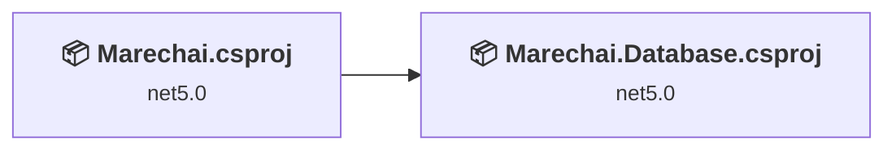
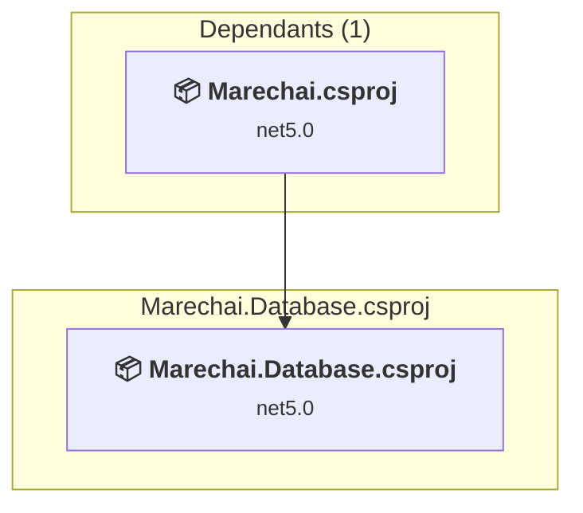
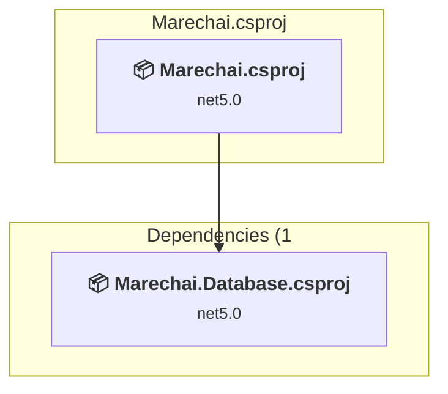

# Projects and dependencies analysis

This document provides a comprehensive overview of the projects and their dependencies in the context of upgrading to .NET 9.0.

## Table of Contents

- [Projects Relationship Graph](#projects-relationship-graph)
- [Project Details](#project-details)

  - [Marechai.Database\Marechai.Database.csproj](#marechaidatabasemarechaidatabasecsproj)
  - [Marechai\Marechai.csproj](#marechaimarechaicsproj)
- [Aggregate NuGet packages details](#aggregate-nuget-packages-details)

## Projects Relationship Graph

Legend:
📦 SDK-style project
⚙️ Classic project

## Project Details

### Marechai.Database\Marechai.Database.csproj

#### Project Info

- **Current Target Framework:** net5.0
- **Proposed Target Framework:** net8.0
- **SDK-style**: True
- **Project Kind:** ClassLibrary
- **Dependencies**: 0
- **Dependants**: 1
- **Number of Files**: 345
- **Lines of Code**: 539045

#### Dependency Graph

Legend:
📦 SDK-style project
⚙️ Classic project

#### Project Package References

| Package | Type | Current Version | Suggested Version | Description |
| :--- | :---: | :---: | :---: | :--- |
| Aaru.CommonTypes | Explicit | 5.2.99.3380-alpha |  | ✅Compatible |
| Microsoft.AspNetCore.Identity.EntityFrameworkCore | Explicit | 5.0.1 | 8.0.22 | NuGet package upgrade is recommended |
| Microsoft.EntityFrameworkCore.Design | Explicit | 5.0.1 | 8.0.22 | NuGet package upgrade is recommended |
| Microsoft.EntityFrameworkCore.Proxies | Explicit | 5.0.1 | 8.0.22 | NuGet package upgrade is recommended |
| Pomelo.EntityFrameworkCore.MySql | Explicit | 5.0.0-alpha.2 |  | ✅Compatible |
| Pomelo.EntityFrameworkCore.MySql.Json.Microsoft | Explicit | 5.0.0-alpha.2 |  | ✅Compatible |

### Marechai\Marechai.csproj

#### Project Info

- **Current Target Framework:** net5.0
- **Proposed Target Framework:** net8.0
- **SDK-style**: True
- **Project Kind:** AspNetCore
- **Dependencies**: 1
- **Dependants**: 0
- **Number of Files**: 9418
- **Lines of Code**: 29053

#### Dependency Graph

Legend:
📦 SDK-style project
⚙️ Classic project

#### Project Package References

| Package | Type | Current Version | Suggested Version | Description |
| :--- | :---: | :---: | :---: | :--- |
| Blazorise.Bootstrap | Explicit | 0.9.2.4 |  | ✅Compatible |
| Blazorise.Icons.FontAwesome | Explicit | 0.9.2.4 |  | ✅Compatible |
| Markdig | Explicit | 0.22.1 |  | ✅Compatible |
| Microsoft.ApplicationInsights.AspNetCore | Explicit | 2.16.0 |  | ⚠️NuGet package is deprecated |
| Microsoft.AspNetCore.Diagnostics.EntityFrameworkCore | Explicit | 5.0.1 | 8.0.22 | NuGet package upgrade is recommended |
| Microsoft.AspNetCore.Identity.EntityFrameworkCore | Explicit | 5.0.1 | 8.0.22 | NuGet package upgrade is recommended |
| Microsoft.AspNetCore.Identity.UI | Explicit | 5.0.1 | 8.0.22 | NuGet package upgrade is recommended |
| Microsoft.EntityFrameworkCore.Proxies | Explicit | 5.0.1 | 8.0.22 | NuGet package upgrade is recommended |
| Microsoft.EntityFrameworkCore.Tools | Explicit | 5.0.1 | 8.0.22 | NuGet package upgrade is recommended |
| Microsoft.VisualStudio.Web.CodeGeneration.Design | Explicit | 5.0.1 | 8.0.7 | NuGet package upgrade is recommended |
| MySql.Data | Explicit | 8.0.22 |  | ✅Compatible |
| Packaging.Targets | Explicit | 0.1.189-* |  | ✅Compatible |
| SkiaSharp | Explicit | 2.80.2 | 3.119.1 | NuGet package contains security vulnerability |
| SkiaSharp.NativeAssets.Linux | Explicit | 2.80.2 |  | ✅Compatible |
| Svg.Skia | Explicit | 0.4.1 |  | ✅Compatible |
| Tewr.Blazor.FileReader | Explicit | 3.0.0.20340 |  | ✅Compatible |
| Unclassified.NetRevisionTask | Explicit | 0.3.0 |  | ✅Compatible |

## Aggregate NuGet packages details

| Package | Current Version | Suggested Version | Projects | Description |
| :--- | :---: | :---: | :--- | :--- |
| Aaru.CommonTypes | 5.2.99.3380-alpha |  | [Marechai.Database.csproj](#marechaidatabasecsproj) | ✅Compatible |
| Blazorise.Bootstrap | 0.9.2.4 |  | [Marechai.csproj](#marechaicsproj) | ✅Compatible |
| Blazorise.Icons.FontAwesome | 0.9.2.4 |  | [Marechai.csproj](#marechaicsproj) | ✅Compatible |
| Markdig | 0.22.1 |  | [Marechai.csproj](#marechaicsproj) | ✅Compatible |
| Microsoft.ApplicationInsights.AspNetCore | 2.16.0 |  | [Marechai.csproj](#marechaicsproj) | ⚠️NuGet package is deprecated |
| Microsoft.AspNetCore.Diagnostics.EntityFrameworkCore | 5.0.1 | 8.0.22 | [Marechai.csproj](#marechaicsproj) | NuGet package upgrade is recommended |
| Microsoft.AspNetCore.Identity.EntityFrameworkCore | 5.0.1 | 8.0.22 | [Marechai.Database.csproj](#marechaidatabasecsproj) [Marechai.csproj](#marechaicsproj) | NuGet package upgrade is recommended |
| Microsoft.AspNetCore.Identity.UI | 5.0.1 | 8.0.22 | [Marechai.csproj](#marechaicsproj) | NuGet package upgrade is recommended |
| Microsoft.EntityFrameworkCore.Design | 5.0.1 | 8.0.22 | [Marechai.Database.csproj](#marechaidatabasecsproj) | NuGet package upgrade is recommended |
| Microsoft.EntityFrameworkCore.Proxies | 5.0.1 | 8.0.22 | [Marechai.Database.csproj](#marechaidatabasecsproj) [Marechai.csproj](#marechaicsproj) | NuGet package upgrade is recommended |
| Microsoft.EntityFrameworkCore.Tools | 5.0.1 | 8.0.22 | [Marechai.csproj](#marechaicsproj) | NuGet package upgrade is recommended |
| Microsoft.VisualStudio.Web.CodeGeneration.Design | 5.0.1 | 8.0.7 | [Marechai.csproj](#marechaicsproj) | NuGet package upgrade is recommended |
| MySql.Data | 8.0.22 |  | [Marechai.csproj](#marechaicsproj) | ✅Compatible |
| Packaging.Targets | 0.1.189-* |  | [Marechai.csproj](#marechaicsproj) | ✅Compatible |
| Pomelo.EntityFrameworkCore.MySql | 5.0.0-alpha.2 |  | [Marechai.Database.csproj](#marechaidatabasecsproj) | ✅Compatible |
| Pomelo.EntityFrameworkCore.MySql.Json.Microsoft | 5.0.0-alpha.2 |  | [Marechai.Database.csproj](#marechaidatabasecsproj) | ✅Compatible |
| SkiaSharp | 2.80.2 | 3.119.1 | [Marechai.csproj](#marechaicsproj) | NuGet package contains security vulnerability |
| SkiaSharp.NativeAssets.Linux | 2.80.2 |  | [Marechai.csproj](#marechaicsproj) | ✅Compatible |
| Svg.Skia | 0.4.1 |  | [Marechai.csproj](#marechaicsproj) | ✅Compatible |
| Tewr.Blazor.FileReader | 3.0.0.20340 |  | [Marechai.csproj](#marechaicsproj) | ✅Compatible |
| Unclassified.NetRevisionTask | 0.3.0 |  | [Marechai.csproj](#marechaicsproj) | ✅Compatible |

