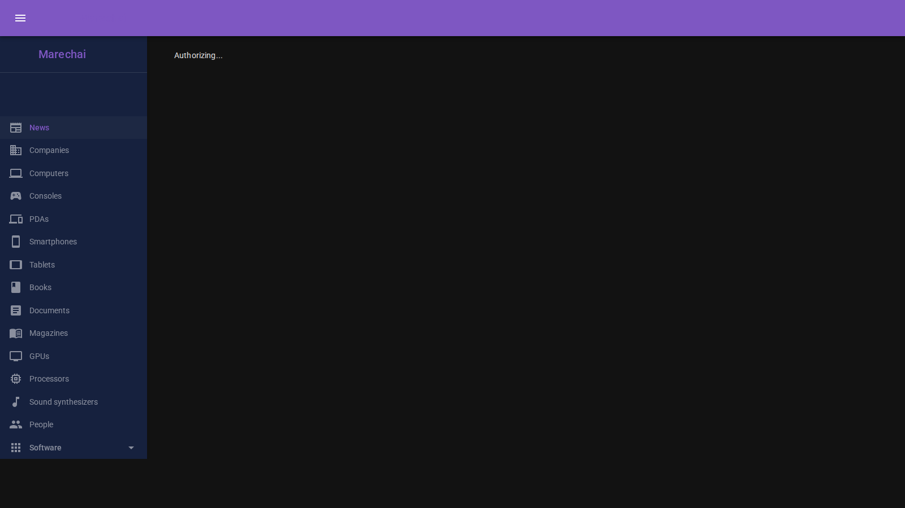
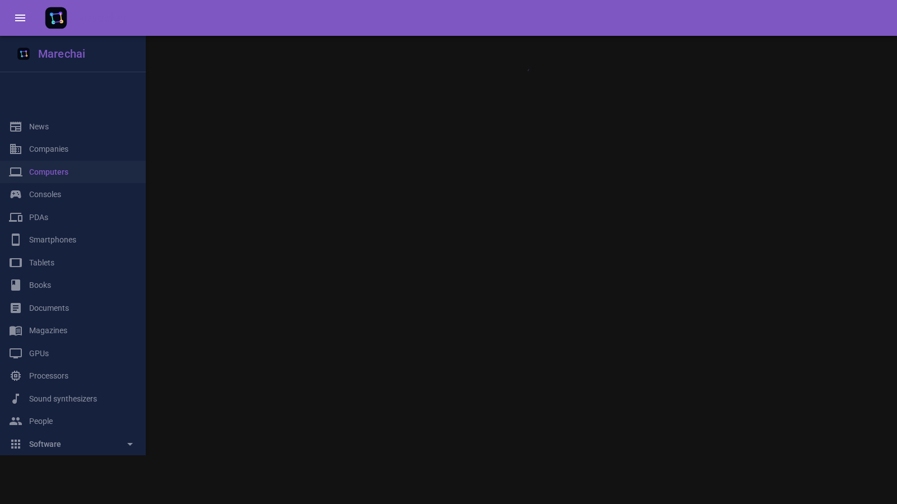
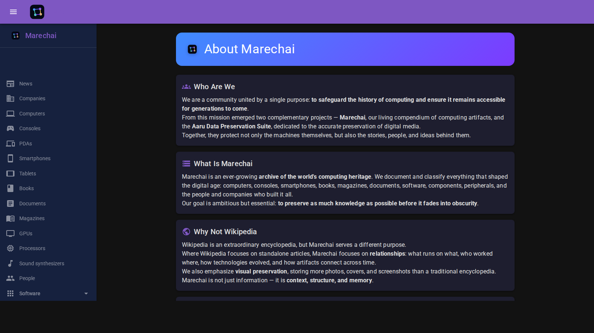
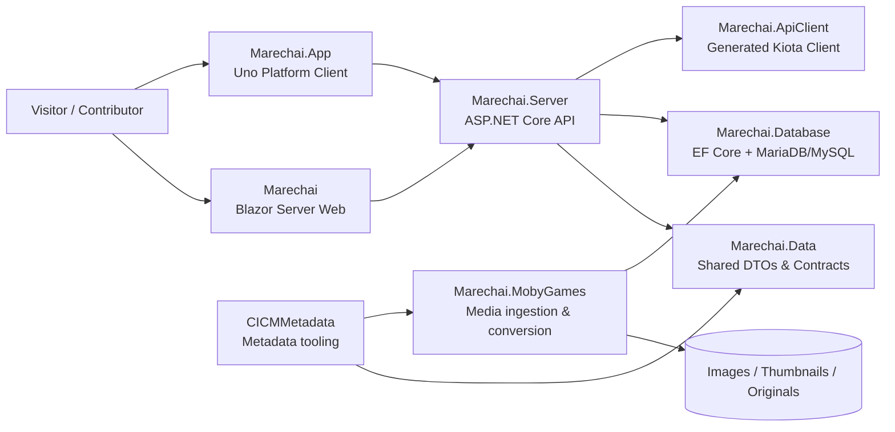

# Marechai

Master repository of computing history artifacts information.

[](https://www.marechai.net)
[](https://dotnet.microsoft.com/)
[](https://platform.uno/)
[](LICENSE)

> A catalog, a platform, and a tiny museum for the machines, software, magazines, people, and stories that shaped computing history.

## TL;DR

Marechai is a .NET-based platform for cataloging and presenting computing history. The repo contains the public web app, a cross-platform Uno client, a backend API, a database layer, and supporting tooling for media and metadata workflows.

If you want the shortest possible summary: it is a curated archive of computing history, built so people can browse, search, contribute, and keep the story of computing from disappearing into the digital equivalent of an attic full of unlabeled floppy disks.

## Who we are

Marechai is a collaborative project devoted to preserving and presenting computing history in a structured, searchable, and human-friendly way. We catalog artifacts such as computers, consoles, peripherals, software, magazines, companies, and people — and we try to do it with enough context that the history is not just stored, but actually understandable.

In short: we are building a home for computing history that is useful to historians, enthusiasts, researchers, and anyone who enjoys discovering how the digital world got here.

## Our mission

Our mission is simple:

- preserve computing history in a format that is easy to search, browse, and maintain
- connect artifacts to the people, companies, and media that shaped them
- make historical information accessible beyond dusty archives and private collections
- support both a web experience and a cross-platform app experience
- keep the project practical, extensible, and, ideally, less chaotic than a basement full of vintage floppy disks

## What Marechai does

Marechai is not just one website. It is a full ecosystem for managing and presenting computing history data.

The project currently provides:

- a searchable catalog of computing artifacts and related entities
- rich metadata for computers, consoles, software, magazines, companies, and people
- media handling for images, thumbnails, and conversion pipelines
- a modern API for data access and integration
- a cross-platform client for browsing on desktop, mobile, and the web
- administrative tooling for curating and maintaining the catalog

If a machine has a keyboard, a screen, a cartridge slot, or a suspicious amount of beige plastic, there is a good chance it belongs here.

## Live site snapshots

Here are a few named snapshots from the live public site so you can see the product shape at a glance.

### 1. Homepage — the public front door



### 2. Computers catalog — the core browsing experience



### 3. About page — mission and scope



## Architecture overview



## Repository structure

The solution is organized as a set of related projects, each with a clear responsibility:

```text
Marechai.slnx
├── Marechai/              # Legacy Blazor Server web application
├── Marechai.App/          # Uno Platform cross-platform client
├── Marechai.Server/       # ASP.NET Core API backend
├── Marechai.Database/     # EF Core data models, migrations, and data access
├── Marechai.Data/         # Shared DTOs, enums, and contracts
├── Marechai.ApiClient/    # Generated Kiota API client for the web app
├── Marechai.Email/        # Email-related functionality
├── Marechai.MobyGames/    # Media ingestion and asset conversion tooling
├── CICMMetadata/          # Metadata-related tooling and resources
└── Documentation/         # Architecture and project documentation
```

## Project breakdown

### Marechai

This is the main web application, built with Blazor Server and MudBlazor.

It is the legacy but still important presentation layer for the catalog, especially for administrative workflows, content browsing, and the public-facing web experience.

### Marechai.App

This is the modern cross-platform client built with Uno Platform.

It targets desktop, mobile, and web scenarios with a shared UI and a responsive design approach. The app is intended to provide a smoother, more flexible experience for users who want to browse the catalog outside the browser.

### Marechai.Server

This is the backend API that exposes the catalog and supporting services.

It provides the HTTP endpoints, authentication flows, OpenAPI documentation, and the integration point between the data layer and the frontend clients.

### Marechai.Database

This project contains the data model, Entity Framework Core migrations, and database-specific access code.

It is the source of truth for the repository's persistent storage and is where schema changes, seed data, and data access logic are maintained.

### Marechai.Data

This shared library contains DTOs, enums, and common contracts used across the solution.

It keeps the API, client, and UI layers aligned and reduces the number of times we have to explain why the same concept somehow exists in three different places.

### Marechai.ApiClient

This contains the generated Kiota API client used by the web and app layers.

It is a practical bridge between the OpenAPI schema and the C# code that consumes it, with the usual amount of generated-code magic and occasional surprise.

### Marechai.Email and Marechai.MobyGames

These are supporting projects for operational concerns such as email delivery and media acquisition/conversion workflows.

They help the main catalog stay useful, updated, and not entirely dependent on manual labor and a heroic amount of coffee.

### CICMMetadata

This repository also includes the CICMMetadata tooling and related resources, which support metadata workflows and related interoperability pieces.

## Where to start

If you are new to the repo, here is the recommended reading order:

1. Start with this README and the live site to understand the product vision.
2. Read [CONTRIBUTING.md](CONTRIBUTING.md) before making changes.
3. Explore the web app in [Marechai](Marechai) if you want to work on the public-facing UI.
4. Explore [Marechai.Server](Marechai.Server) and [Marechai.Data](Marechai.Data) if you want to understand the API contract.
5. Explore [Marechai.Database](Marechai.Database) if you want to work on persistence, migrations, or schema design.
6. Explore [Marechai.App](Marechai.App) if you want to work on the cross-platform client experience.
7. Explore [Marechai.MobyGames](Marechai.MobyGames) and [CICMMetadata](CICMMetadata) if you are interested in ingestion, metadata, or media pipelines.

## Technology stack

The project is built on a modern .NET stack:

- .NET 10.0
- ASP.NET Core
- Blazor Server
- Uno Platform
- Entity Framework Core
- MariaDB / MySQL
- Kiota for API client generation
- MudBlazor for web UI components
- SkiaSharp for rendering-related work
- ImageMagick with AVIF/HEIF and WebP support for media processing

## Prerequisites

To work on this repository locally, you will need:

- the .NET 10.0 SDK (the repo is configured with `global.json`)
- a MariaDB or MySQL-compatible database
- ImageMagick with HEIF, WebP, and AVIF support available in `PATH`
- the Uno Platform tooling needed for the cross-platform app
- a working development environment that can build and run .NET applications

## Quick start

1. Restore the solution:

   ```bash
   dotnet restore Marechai.slnx
   ```

2. Configure your application settings.

   The server and app projects rely on configuration files such as `appsettings.json` and environment-specific overrides. Make sure the database connection string and API settings are set correctly for your environment.

3. Build the backend:

   ```bash
   dotnet build -c Debug Marechai.Server/Marechai.Server.csproj
   ```

4. Build the desktop app (optional, but useful for local validation):

   ```bash
   dotnet build -c Debug -f net10.0-desktop Marechai.App/Marechai.App.csproj
   ```

5. Run the API server:

   ```bash
   dotnet run --project Marechai.Server/Marechai.Server.csproj --launch-profile http
   ```

6. Run the Uno app when needed:

   ```bash
   dotnet run -c Debug -f net10.0-browserwasm --project Marechai.App/Marechai.App.csproj
   ```

## Development notes

- The solution file is `Marechai.slnx`.
- `Marechai.Server` applies pending EF Core migrations on startup during local development.
- The API client is generated from the OpenAPI schema and should be updated carefully when the backend contract changes.
- Image processing is an important part of the project; make sure your environment can handle the expected formats.
- The repository uses central package management through `Directory.Packages.props`.

## Contributing

Contributions are welcome. Before making changes, please read [CONTRIBUTING.md](CONTRIBUTING.md).

A few important notes:

- commits are expected to be signed
- follow the existing code style and project conventions
- keep changes focused and well explained
- if you touch the API contract, expect to update the generated client as well

## Why this project matters

Computing history is full of fascinating details: the hardware, the software, the people, the marketing, the bugs, the odd design decisions, and the truly unforgettable interfaces. Marechai exists to keep that material organized and accessible instead of letting it disappear into the digital equivalent of a landfill full of magnetic tape.

This repository is the code behind that effort: a practical platform for cataloging, exploring, and preserving the story of computing, one artifact at a time.

If you are here to contribute, browse, or just understand what the project is doing, welcome. The machines are waiting, and the history is significantly more interesting than it has any right to be.